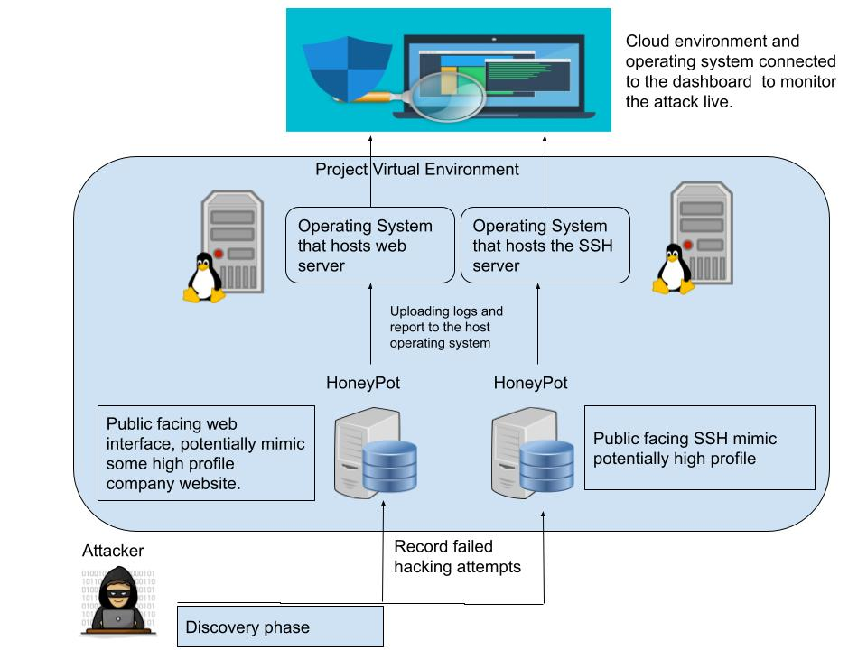
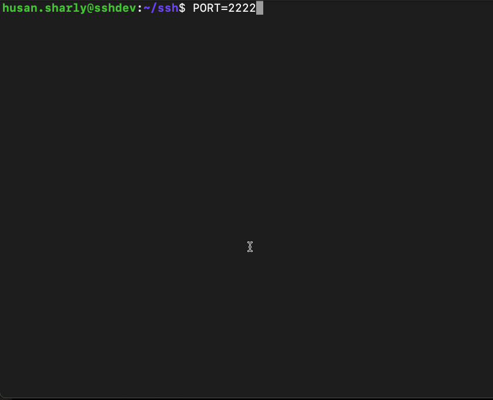
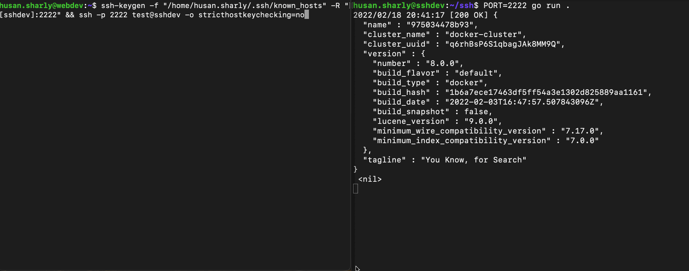
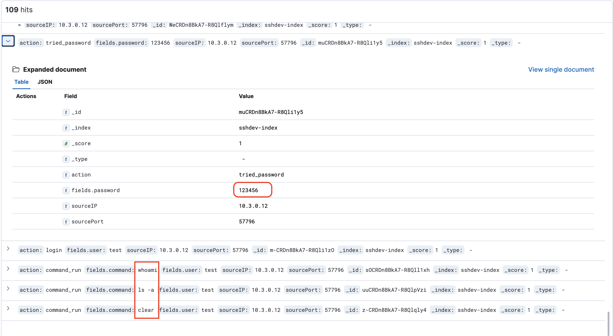
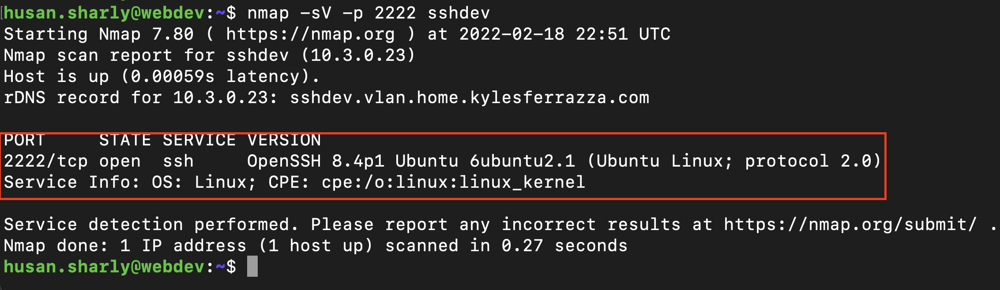

# Honeystats   
Honeystats is an interactive honeypot that utilizes open-source technology. It is deployable to any organization or enterprise without too many dependencies or hardware requirements. Honeystats is designed to be hosted in a virtual environment to capture activities of adversaries on the internet and monitor their attack vectors and methods. By collecting critical information and data, ranging from commands being run to user information, Honeystats generates detailed reports as JSON documents that are sent to Elasticsearch and will reflect the activities that are captured from the honeypot in real-time. This data can then be rendered in Kibana in the form of a dashboard with visualizations. Honeystats gives users the flexibility to filter what content is present on their dashboard with minimal effort. 

## Sprint 1 - Approach
-  The diagram below shows the overall layout of the project:

- specify scope/deliverable goals and research technology will be implemented.
- The service that will be focucsed are SSH service and Webserver.

## Sprint 2 - Doing 

- Setting up the dev env for SSH as well as web.

- inital SSH service set up and runing on the ssh dev envirment. 

- Demo connecting to the the SSH servie that been created in the sshdev enviorment from the webdev vms.

- Connection to the ssh sercive will capture all activies and send it to the elsastic search in real time. Including the password that were entered:

- Mimic the acutal SSH service footprint.

## Sprint 3 - Polishing

## Sprint 4 - Presenting

## Possible research

Please visit the [Wiki](https://github.com/honeystats/honeystats/wiki) for more addtional information. 
