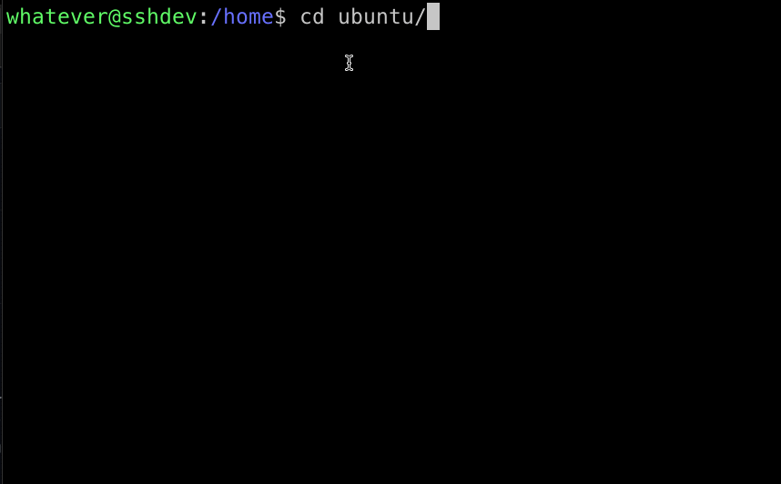
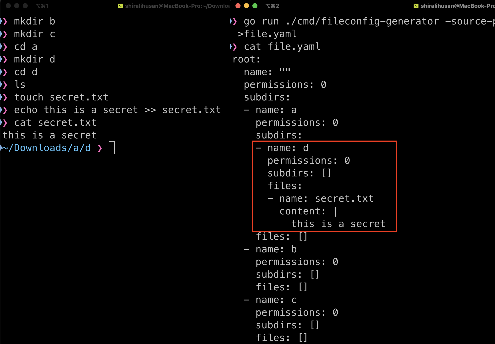
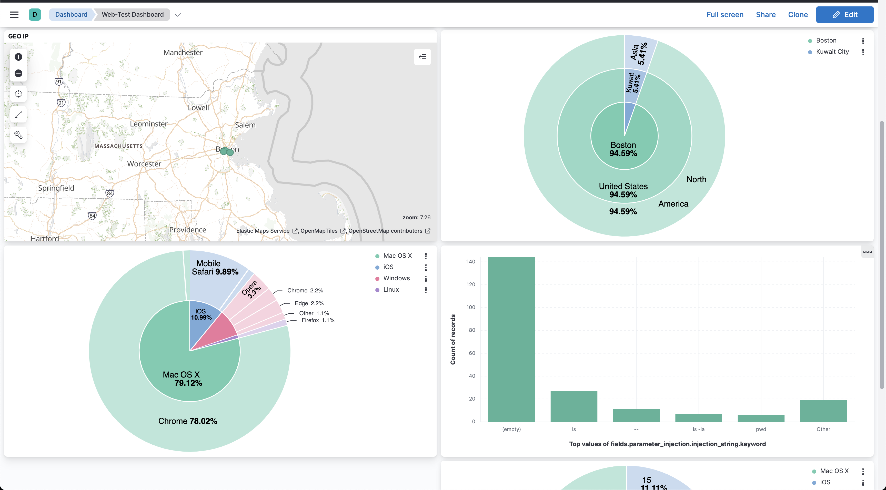

# Honeystats   
Honeystats is an interactive honeypot that utilizes open-source technology. It is deployable to any organization or enterprise without too many dependencies or hardware requirements. Honeystats is designed to be hosted in a virtual environment to capture activities of adversaries on the internet and monitor their attack vectors and methods. By collecting critical information and data, ranging from commands being run to user information, Honeystats generates detailed reports as JSON documents that are sent to Elasticsearch and will reflect the activities that are captured from the honeypot in real-time. This data can then be rendered in Kibana in the form of a dashboard with visualizations. Honeystats gives users the flexibility to filter what content is present on their dashboard with minimal effort. 

## Sprint 1 - Approach
-  The diagram below shows the overall layout of the project:


- specify scope/deliverable goals and research technology will be implemented.
- The service that will be focucsed are SSH service and Webserver.

## Sprint 2 - Doing 

- Setting up the dev env for SSH as well as web.


- inital SSH service set up and runing on the ssh dev envirment. 


- Demo connecting to the the SSH servie that been created in the sshdev enviorment from the webdev vms.


- Connection to the ssh sercive will capture all activies and send it to the elsastic search in real time. Including the password that were entered:


- Mimic the acutal SSH service footprint.


- The honeystats have a customizable file directory that is tailored to customers' needs as well as flexible.  The [file.yaml](https://github.com/honeystats/ssh/blob/main/files.yaml) consist of linux like directory with permission and content which mimic the actual directory.

- the following commands are implemented and fully functional.
```
cat
cd 
clear 
exit 
ls 
pwd 
whoami
```
the autocomplete and tabs are also fully functional shows as following. 



## Sprint 3 - Polishing

- The honeystats have taken a safer approach instead of giving real system command calls when calling the the command mentions above, we give a YAML file directory to make sure that what the adversary do still is in the YAML file not the actual file system. 

```
go run ./cmd/fileconfig-generator -h
Usage of fileconfig-generator:
  -source-path string
    	path from which to generate the YAML file
```

- The YAML file will have mimic given directory and recursively call the sub directory and file content to generate a directory given a file path as mentioned above. This gives flexibility and easier deployment to set up the honesty environment.  

- Demo image:




- Web Interface and Admin Console were also deployed and have functionality. 
***REMOVED***


- The Webpage rejects arbitrary credentials and will allow login with a valid username and password that are not too secure. 


- The website is vulnerable to SQL injection attempts. Please see below for the demos.


- The website is also vulnerable to SQL injection for the password field. Please see below for the demos. 


- The web Dev also supports OS command injections:
```
ls
pwd
hostnamectl
```

- Similar to the SSH services that is provided , the Honeystats web operations also keep a log and send statistics, headers, and commands that users have tried in real time.




## Sprint 4 - Presenting

## Possible research

Please visit the [Wiki](https://github.com/honeystats/honeystats/wiki) for more additional information. 
